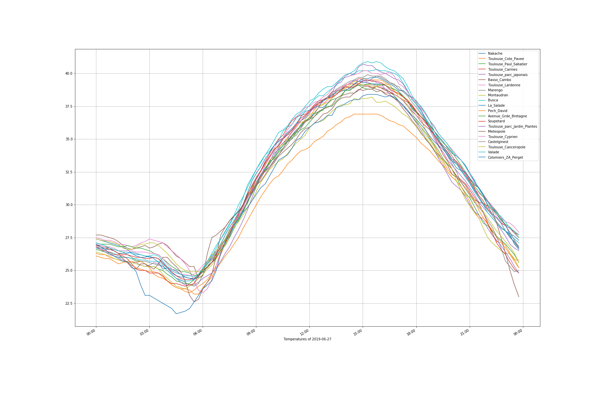

# Urban Heat Islands

Visualize Urban Heat Islands (UHI) in Toulouse - France

Data from meteo stations can be downloaded on the French [open source portal](https://www.data.gouv.fr/)

Each met file is stored as a table (dataframe) with [pandas](https://pandas.pydata.org/)

A 2D visualization of met stations is realized with [ipyleaflet](https://ipyleaflet.readthedocs.io/en/latest/)

A temperature chart is realized with [Matplotlib](https://matplotlib.org/)

Example: temperature chart for all met station on 2019/06/27

## Running the tests

The entire code is available in the file urban-heat-islands.ipynb

## Built With

* [pandas](https://pandas.pydata.org/) - Python Data Analysis Library
* [ipyleaflet](https://ipyleaflet.readthedocs.io/en/latest/) - Interactive maps in the Jupyter notebook
* [Matplotlib](https://matplotlib.org/) - Python 2D plotting library

## Authors

* **Thomas Dubot** 

## License

This project is licensed under the MIT License - see the [LICENSE.md](LICENSE.md) file for details